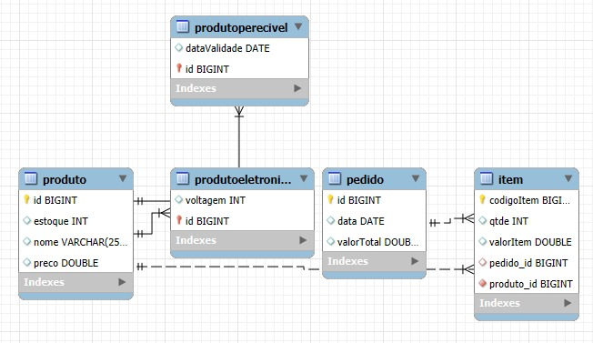

# AA2 - Sistema de Produtos e Pedidos

Aplicação Java com Javalin + Hibernate + MySQL para cadastro de produtos e gerenciamento de pedidos.

## Autores

- Laura Menezes
- Davi Puddo

## Tecnologias

- Java 17+ (funciona também com Java 21)
- Maven
- Hibernate ORM
- Javalin
- MySQL
- MySQL Workbench (para administrar o banco)

## Pré-requisitos

Antes de rodar, confirme que você tem:

- JDK instalado e configurado no PATH (`java -version`)
- Maven instalado (`mvn -version`)
- MySQL Server rodando localmente
- MySQL Workbench instalado

## Configuração do Banco (MySQL Workbench)

A aplicação usa as configurações do arquivo `src/main/resources/hibernate.cfg.xml`.

Parâmetros atuais no projeto:

- URL: `jdbc:mysql://localhost:3306/db_projeto_produtos_es?createDatabaseIfNotExist=true&useTimezone=true&serverTimezone=UTC`
- Usuário: `root`
- Senha: definida no mesmo arquivo (`hibernate.connection.password`)

### Passos no Workbench

1. Abra o MySQL Workbench e conecte no seu servidor local.
2. Se preferir criar o schema manualmente, execute:

```sql
CREATE DATABASE IF NOT EXISTS db_projeto_produtos_es;
```

3. Se seu usuário/senha for diferente, edite em `src/main/resources/hibernate.cfg.xml`:
   - `hibernate.connection.username`
   - `hibernate.connection.password`

Observação: com `hibernate.hbm2ddl.auto=update`, as tabelas são criadas/atualizadas automaticamente ao iniciar a aplicação.

## Como Rodar o Sistema

## Opção 1 - VS Code 

1. Abra o projeto AA2 no VS Code.
2. Abra a classe principal: `src/main/java/com/exemplo/web/WebMain.java`.
3. Clique em Run (ou rode pelo painel de execução Java).
4. O servidor sobe em:

- http://localhost:8080

## Opção 2 - Linha de comando

1. Na raiz do projeto, compile:

```bash
mvn clean compile
```

2. Rode a classe principal pela sua IDE, ou usando sua configuração Java atual.

## Páginas do Sistema

- Home: http://localhost:8080/
- Produtos: http://localhost:8080/produtos.html
- Pedidos: http://localhost:8080/pedidos.html

## API (resumo rápido)

- `GET /api/produtos`
- `POST /api/produtos`
- `PUT /api/produtos/{id}`
- `DELETE /api/produtos/{id}`
- `GET /api/pedidos`
- `POST /api/pedidos`
- `GET /api/pedidos/{id}/itens`
- `POST /api/pedidos/{id}/itens`
- `DELETE /api/itens/{id}`

---

## Relatório da Atividade 

Este trabalho teve como objetivo desenvolver um protótipo web para gerenciamento de produtos e pedidos, integrando backend em Java com persistência relacional em MySQL. A aplicação foi construída com Javalin para disponibilização das rotas HTTP e Hibernate/JPA para mapeamento objeto-relacional, com apoio do MySQL Workbench na administração do banco e no processo de engenharia reversa. O escopo funcional implementado inclui cadastro, listagem, alteração e exclusão de produtos, criação de pedidos, adição e remoção de itens, atualização de estoque e recálculo do valor total do pedido conforme as operações realizadas.

No modelo de domínio, a entidade Produto atua como classe base com especializações para ProdutoEletronico e ProdutoPerecivel. A entidade Pedido possui relacionamento um-para-muitos com Item, enquanto Item referencia tanto o pedido quanto o produto correspondente. Durante os testes de uso, foi identificado um problema de persistência ao inserir itens em pedidos (`TransientObjectException`), causado por tentativa de flush com entidade Item ainda não persistida no contexto esperado. A correção aplicada consistiu em ajustar o fluxo transacional para persistência explícita do item no momento da inclusão, estabilizando a operação e mantendo consistência entre pedido, item e estoque.

Como resultado, o sistema atende aos requisitos principais propostos para a atividade, com backend funcional, integração com banco relacional e páginas web para uso básico. Como evolução futura, recomenda-se implementar testes automatizados, padronizar respostas de erro da API, reforçar validações de entrada, adicionar paginação/filtros nas listagens e mover credenciais de banco para variáveis de ambiente.

### Diagrama de Entidades 

A figura abaixo representa o diagrama entidade-relacionamento gerado por reverse engineering no MySQL Workbench a partir do schema da aplicação.



Legenda: diagrama ER gerado automaticamente a partir do schema db_projeto_produtos_es no MySQL Workbench.

## Solução de Problemas

- Erro de conexão com banco:
  - Verifique se o MySQL Server está ativo.
  - Confirme usuário e senha em `hibernate.cfg.xml`.
  - Teste a conexão no Workbench com as mesmas credenciais.

- Porta 8080 ocupada:
  - Encerre outro processo que esteja usando a porta, ou altere a porta no `WebMain`.

## Vídeo de Demonstração

https://github.com/user-attachments/assets/728a4a38-7258-42ab-9c6f-9ae1bcab77a7

O vídeo de demonstração está disponível no projeto em:

- [assets/video_funcionando.mp4](assets/video_funcionando.mp4)
